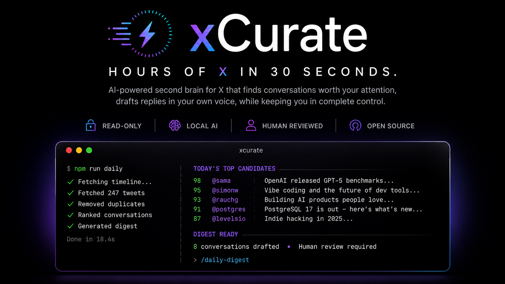

<p align="center">
  
</p>

# xcurate

A terminal-first tool to **read** X/Twitter, curate the tweets worth replying to, and draft
replies in your own voice — with a human approving and posting every reply manually.

xcurate does the tedious part (fetch → dedup → rank → surface a short list of candidates) with a
deterministic pipeline, and leaves the judgement (which tweets deserve a reply, and what to say)
to you, assisted by [Claude Code](https://claude.com/claude-code) slash commands. It never posts.

## Principles (non-negotiable)

1. **Read-only against X.** Fetching uses cookie auth via an unofficial GraphQL reader. The code
   **never posts, likes, follows, DMs, retweets, bookmarks, or writes anything** to X. There is
   no flag or config that enables posting.
2. **Free.** No paid X API tier, no paid services. Classification runs on a local model (Ollama).
3. **Human-in-the-loop.** The pipeline's output is a review document. You approve and post
   **manually**; `mark-posted` only *records* what you already did.
4. **Your cookie is a secret.** `TWITTER_AUTH_TOKEN` / `TWITTER_CT0` live only in `.env`
   (gitignored) and are never logged or printed. `auth:check` reports validity without dumping them.
5. **Gentle on the source.** Scheduled ingest is hourly and feed-only — one jittered request per
   run, exponential backoff, aggressive caching.

## Architecture

- **Deterministic TypeScript pipeline (`src/`):** fetch → normalize → store (SQLite) → dedup →
  rank → export `data/candidates.json`. Tweets are bucketed into topics by a local Ollama model.
- **Claude Code agent does the judgement** via slash commands in `.claude/commands/` — no LLM API
  key needed. `/daily-digest` reads the candidates and your `config/voice.md`, drops the weak
  ones, and drafts replies into `digest/YYYY-MM-DD.md`. `/calibrate-voice` proposes an improved
  voice profile from your own past replies; `/classify-tweets` backfills topic labels.

📖 **[docs/architecture.md](docs/architecture.md)** walks through the whole system with diagrams —
the read-only guarantee, the ranking maths, the data model, and why the work is split this way.

## Setup

Requires **Node ≥ 22**. Optional: [Ollama](https://ollama.com) with a small instruct model
(e.g. `qwen2.5:3b-instruct`) for local topic classification.

```bash
npm install

# 0. Enable the local guard that blocks committing your X cookie.
#    Git hooks aren't shared through a clone, so this is once per machine.
git config core.hooksPath .githooks

# 1. Provide your own X session cookie (kept local, gitignored):
cp .env.example .env
#    then fill TWITTER_AUTH_TOKEN and TWITTER_CT0 from your logged-in x.com browser session
#    (DevTools > Application > Cookies). These are secrets — never commit or share them.
npm run auth:check          # confirm the cookie is valid (does not print its value)

# 2. Tell it whose timelines to weight (edit with your own handles):
#    config/accounts.seed.json  — currently placeholder examples
npm run accounts:list

# 3. Make the voice yours:
#    config/voice.md — a template; rewrite it in your own voice (or run /calibrate-voice)
```

## Running it

```bash
npm run daily          # full ingest + build candidates (a few times a day / manual)
npm run hourly         # feed-only ingest + candidates (what the scheduler runs)
npm run stats          # label coverage, per-bucket feedback, suggested weights

# topic classification (local model):
npm run buckets:export && npm run buckets:classify && npm run buckets:apply

# after you post a reply by hand, record it (never posts — only records):
npm run mark-posted -- --tweet <id> --reply "..."
npm run skip -- --tweet <id>

npm run help           # full command list
```

Then, in Claude Code, run `/daily-digest` to draft replies from the current candidates into
`digest/YYYY-MM-DD.md`, review them, and post the good ones **yourself**.

Optional hourly scheduling (systemd units in `ops/`) is documented in `manual-run.md`; the unit
files are templates — edit the paths for your machine before installing.

## Your data stays local

`data/` (the SQLite DB, fetched tweets, candidates, your recorded replies) and `digest/` (drafted
replies) are **gitignored** and never leave your machine. `config/voice.md` and
`config/accounts.seed.json` in this repo are placeholders — replace them with your own.

## License

MIT — see [LICENSE](LICENSE).
