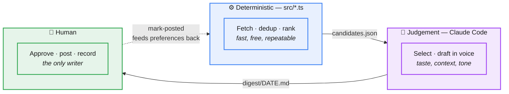
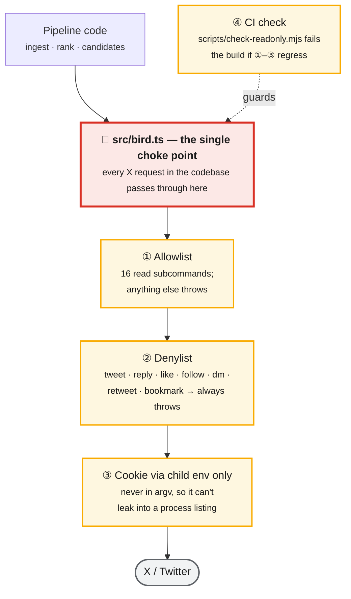
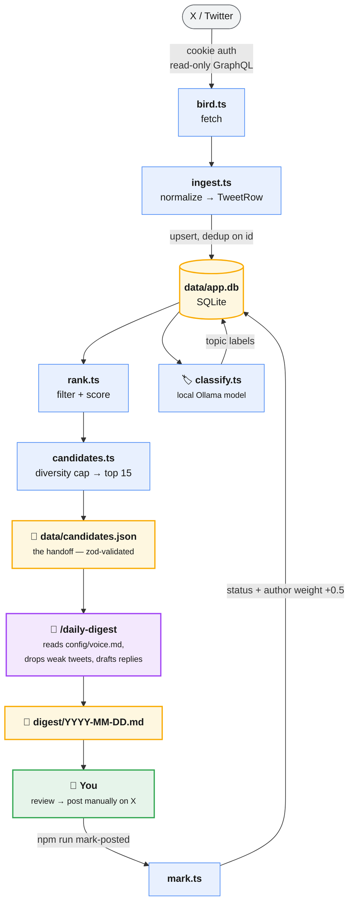
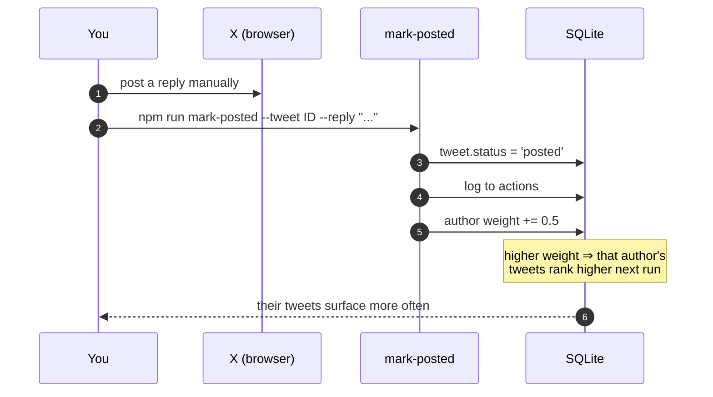
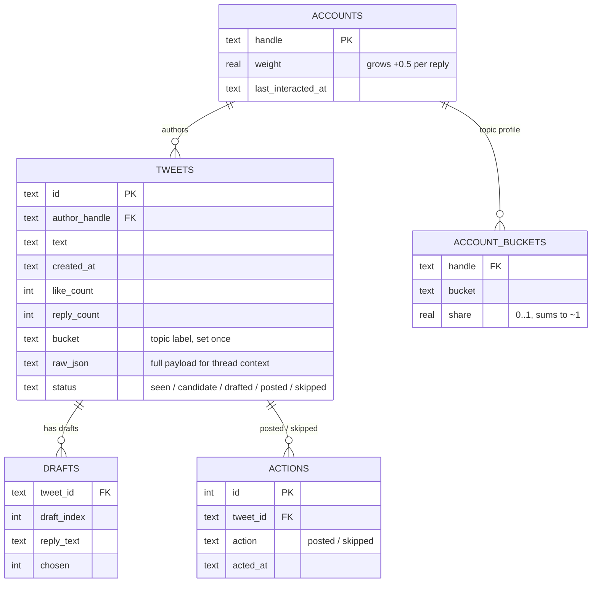
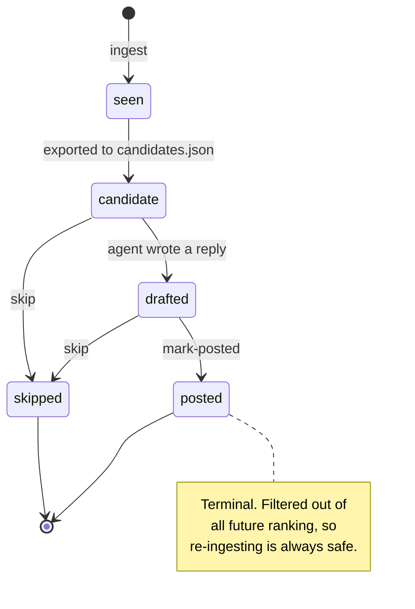
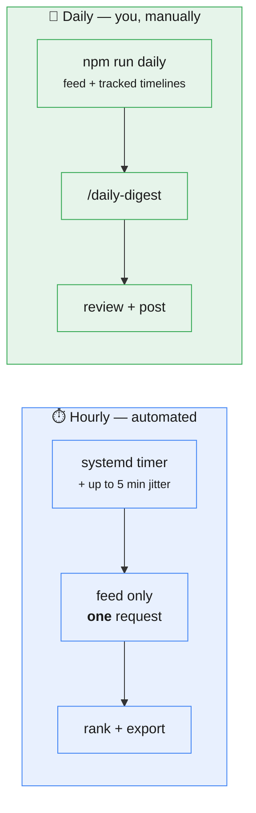

# How xcurate works

A tour of the system for anyone reading the code for the first time — what the pieces are,
why they're split the way they are, and where the interesting decisions live.

> **Related reading.** [`../README.md`](../README.md) is the quick start.
> [`../xcurate.md`](../xcurate.md) is the full build spec, with section numbers (`§7`, `§12`)
> that the code comments cite. This document is the orientation layer between them.

---

## The one idea

Reading X well is two different jobs, and they want two different kinds of machine.

**Finding what *might* be worth replying to** is mechanical: fetch, deduplicate, score by
recency and author and engagement, drop the obvious junk, keep the top N. Rules do this
perfectly, run in milliseconds, cost nothing, and behave identically every time.

**Deciding what *actually* deserves a reply, and what to say** is judgement. It needs taste,
context, and a sense of your voice. No scoring function gets there.

So xcurate refuses to blur them. A deterministic TypeScript pipeline narrows hundreds of tweets
down to ~15 candidates and hands them over as a plain JSON file. An LLM agent — Claude Code,
reading that file through a slash command — does the judging and drafting. A human posts.



The payoff: the expensive, non-reproducible part is as small as possible, and everything else
is ordinary code you can read, test, and trust.

---

## The hard rule: xcurate never writes to X

This is the constraint the whole design bends around. xcurate reads your timeline using your
browser session cookie via an unofficial GraphQL reader. That cookie can do anything your
account can — post, delete, DM, follow. So the codebase treats "we only read" as something to
*enforce structurally*, not merely intend.

Four layers, each independently sufficient:



Layer ④ is what keeps this true over time. `scripts/check-readonly.mjs` runs on every push and
pull request, and asserts three structural properties: the denylist still names every write
verb, no write verb has appeared in the allowlist, and **no module other than `bird.ts` can
spawn a process or resolve the reader package**. That last one matters most — without it,
someone could bypass the allowlist entirely and the first two checks would still pass.

Consequences worth internalising:

- `mark-posted` **records** a reply you already posted by hand. It never posts.
- There is no flag, config key, or environment variable that enables posting. Adding one is
  out of scope by design.
- The digest is a file. Publishing it is your job, done in your browser.

---

## The pipeline, end to end



### 1 · Fetch and normalize — `bird.ts`, `ingest.ts`

Two sources: your Following feed, and the profile timelines of accounts you track in
`config/accounts.seed.json`. Raw GraphQL payloads get flattened into a stable `TweetRow`,
defensively — field names vary across response shapes, so every read falls back rather than
throwing. The complete payload is kept in `raw_json` so the agent can reconstruct thread
context later.

Being a polite guest is a design goal, not an afterthought: every request is jittered
(20–90s), retryable errors back off exponentially, and an authentication failure **aborts the
entire run immediately** rather than hammering a dead cookie.

### 2 · Store and dedup — `db.ts`

SQLite via `better-sqlite3`, in WAL mode, with versioned migrations that each run exactly once
inside a transaction. Deduplication falls out of `INSERT … ON CONFLICT(id) DO UPDATE`: seeing a
tweet again refreshes its engagement counts and payload, but deliberately **preserves `status`
and `text`** — so re-ingesting can never resurrect a tweet you already skipped.

### 3 · Rank — `rank.ts`

First a coarse filter drops what can never be a candidate: reposts, anything outside the time
window, already posted or skipped, muted authors, and pure link/ad tweets. Survivors get scored:

```
score = bucketMultiplier × ( 1.0·recency + 1.4·authorWeight + 0.8·engagement )
        − 0.6·penalty
```

| Term | Meaning | Range |
|---|---|---|
| `recency` | Linear decay: 1.0 fresh → 0 at the window edge (24h) | 0–1 |
| `authorWeight` | The author's tracked weight ÷ the highest weight in the pool | 0–1 |
| `engagement` | `likes + 2×replies + quotes`, **normalized against that author's own baseline**, capped at 3× | 0–1 |
| `penalty` | Low-signal shapes: walls of text, emoji-only, hashtag spam | 0–1 |
| `bucketMultiplier` | Per-topic nudge from `config/buckets.json` (e.g. `civic` = 0.8) | 0.8–1.0 |

Two details worth noticing. **Engagement is relative, not absolute** — measured against each
author's own mean once we have ≥3 of their tweets, so a quiet account's unusually busy post can
out-rank a big account's routine one. And the **bucket multiplier scales only the positive
terms**, never the penalty: down-weighting a topic must never make a low-quality tweet look
better than it is.

### 4 · Diversity cap and export — `candidates.ts`

Score order alone lets one viral topic monopolize the digest. So the final pass walks the ranked
pool taking at most `maxPerBucket` (4) from any one topic, up to `candidateLimit` (15). Tweets
with no bucket signal *bypass* the cap — early on, before labels accumulate, everything should
still flow through.

The result is written as `data/candidates.json`, validated with zod on the way out. That file is
the entire contract between the deterministic half and the agent: **no shared memory, no API, no
coupling.** You can inspect it, diff it, or hand-edit it.

---

## Where the agent takes over

`/daily-digest` is a prompt, not code — it lives in
[`../.claude/commands/daily-digest.md`](../.claude/commands/daily-digest.md). It reads
`candidates.json` and `config/voice.md`, then does what scoring can't:

- **Drops aggressively.** A short digest of good replies beats a full one padded with filler.
- **Varies the reply function.** Not every reply is an "agree and build" — some are a joke, a
  question, a disagreement, a warm reaction.
- **Writes in first person, as you**, guided by `voice.md` and the per-bucket `replyStance`.

Output is `digest/YYYY-MM-DD.md`: each tweet quoted for context, one or two drafted replies with
character counts, and pre-filled `mark-posted` commands to copy after you post.

Because judgement lives in a prompt rather than in code, tuning it is editing prose — no
redeploy, no API key, no model plumbing.

---

## The feedback loop

The one place the system learns your preferences:



Replying to someone repeatedly raises their weight, which raises their tweets in future
rankings — the system converges on the people you actually talk to. `npm run skip` records the
opposite. `npm run stats` aggregates this history into *suggested* bucket multiplier changes;
it only ever suggests, never edits your config.

---

## Data model



Every tweet moves through one lifecycle:



---

## Topic buckets

Every tweet gets exactly one of five topic labels — `professional`, `personal-social`, `ideas`,
`civic`, `other` — defined in [`../config/buckets.json`](../config/buckets.json) with a
definition, a **reply stance**, and a rank multiplier.

The taxonomy is deliberately small. An earlier 16-bucket version was collapsed after evidence
showed 12 of those buckets changed no downstream decision at all: if a bucket doesn't alter
ranking or how you'd reply, it's overhead. Every surviving bucket earns its place.

Labelling runs on a **local Ollama model** (`qwen2.5:3b-instruct`) rather than a paid API —
bulk classification is mechanics, not judgement. Output is schema-constrained to an enum of
bucket names, so an invalid label is impossible by construction. If Ollama isn't running, the
step fails cleanly and the database is left untouched.

Labels do double duty. A tweet's own label feeds the multiplier; and the rolling distribution
across an author's labelled tweets forms an **account profile**, which predicts a bucket for
tweets that haven't been classified yet.

---

## Two cadences



The hourly job is deliberately minimal — a **single jittered request** — so the timeline is
sampled steadily without ever looking like scraping. Deep reads (tracked timelines, the
calibration fetch) stay on the manual path, a few times a day at most. Full operational detail
is in [`../manual-run.md`](../manual-run.md).

---

## Where things live

```
src/
├── bird.ts         🚦 the read-only choke point — every X request
├── ingest.ts       fetch → normalize → upsert (jitter, backoff)
├── db.ts           SQLite, versioned migrations
├── rank.ts         filter + score
├── candidates.ts   diversity cap → data/candidates.json
├── buckets.ts      taxonomy, account profiles
├── classify.ts     local Ollama classifier
├── calibrate.ts    voice calibration (§12)
├── mark.ts         record posted/skipped — never posts
├── stats.ts        feedback aggregation, suggested weights
└── cli.ts          command surface

config/
├── settings.json   window, limits, weights, classifier
├── buckets.json    taxonomy + reply stances + multipliers
├── voice.md        ✏️ how your replies should sound — make this yours
└── accounts.seed.json

.claude/commands/   the judgement layer, as prompts
data/               SQLite + JSON artifacts   (gitignored)
digest/             drafted replies            (gitignored)
```

`data/` and `digest/` never leave your machine. `config/voice.md` and `accounts.seed.json` ship
as placeholders — replace them with your own.

---

## Design constraints

These are non-negotiable, and explain most of the choices above:

| | Constraint | Consequence |
|---|---|---|
| 1 | **Read-only against X** | Four enforcement layers; a CI gate; no posting escape hatch, ever |
| 2 | **Free** | No paid API tier; local model for bulk classification |
| 3 | **Human in the loop** | Output is a document; a person approves and posts |
| 4 | **The cookie is a secret** | `.env` only; never logged, printed, or embedded; a pre-commit hook blocks it |
| 5 | **Gentle on the source** | Hourly = one jittered request; backoff; aggressive caching |

On #4, one sharp edge worth knowing: both cookie values are bare hex with no provider prefix, so
**GitHub's secret scanning cannot detect them**. The local pre-commit hook in `.githooks/` is the
only thing that will. It isn't carried by a clone — enable it once per machine:

```bash
git config core.hooksPath .githooks
```
