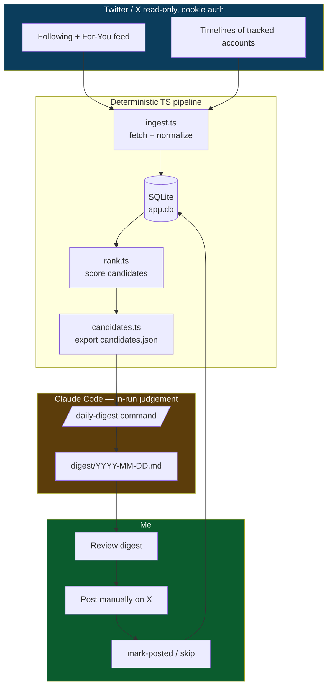
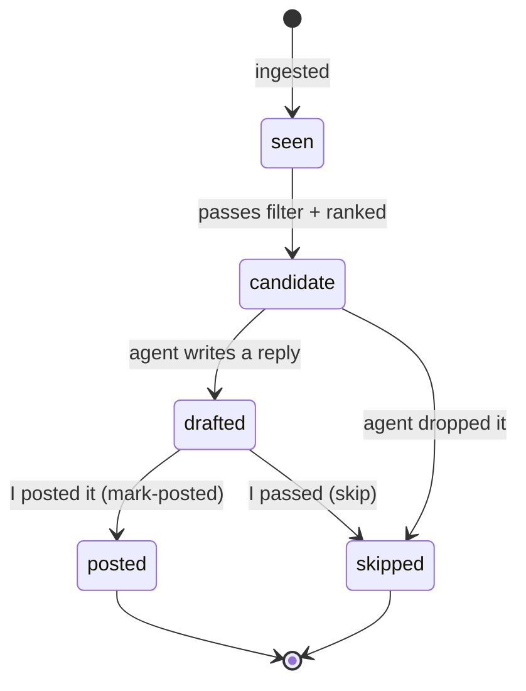
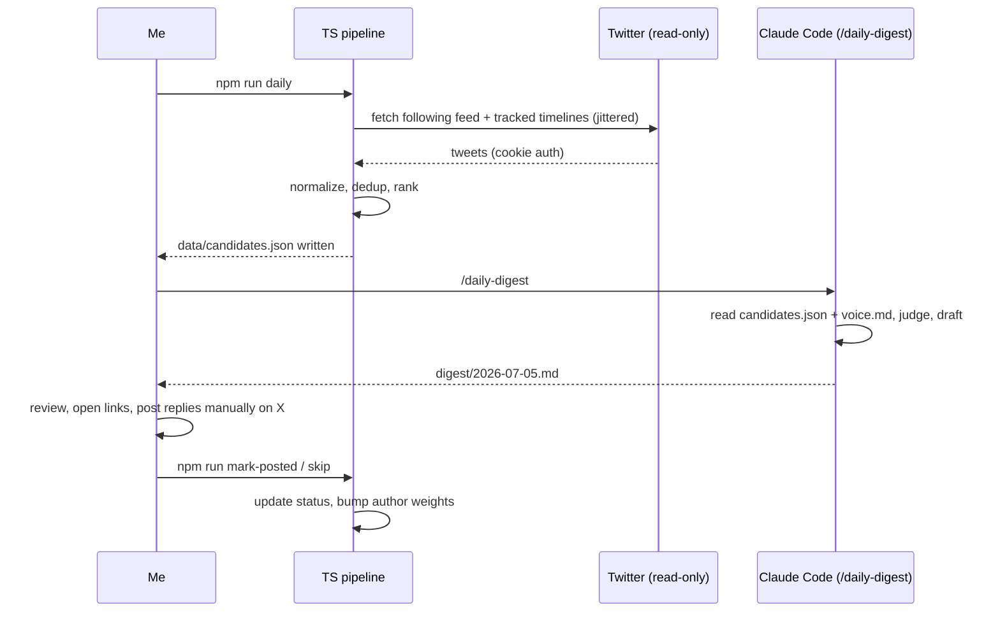
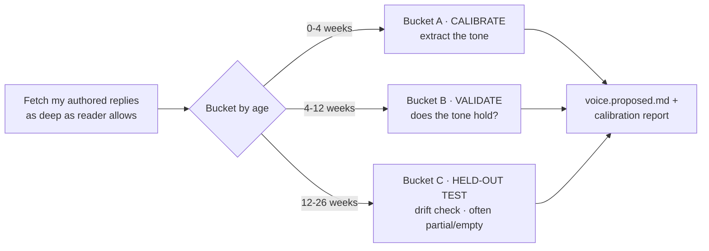

# xcurate — Complete Build Spec

_A terminal-first tool to read X, curate the tweets worth replying to, and draft replies in my voice._

> **What this file is:** a single, self-contained build brief for **Claude Code**. Put it in an
> empty folder, open Claude Code there, and say:
> *"Read `xcurate.md` and build it following the Build Plan (§13), stopping at each checkpoint."*
> Claude Code both **builds** the project and later **runs the judgement steps itself**
> (daily drafting and voice calibration). No separate LLM API key is required.

---

## 1. Goal

Read Twitter/X from the terminal for free, keep tabs on the accounts I interact with most, and
once a day produce a **digest** of tweets worth replying to — each with a suggested reply
drafted in my voice. I review the digest, **post manually** on X, then record what I posted so
the system gets better at picking accounts and matching my tone. **Nothing is ever posted
automatically.** I am the only thing that touches the "reply" button.

---

## 2. Hard constraints (non-negotiable)

1. **Read-only network access to X.** Fetching uses cookie auth via an unofficial GraphQL
   reader (`bird`). Reliable for reading, risky for posting. Therefore the code **must never
   post, like, follow, DM, or write anything to X.** Posting is 100% manual by the human.
2. **Free.** No paid X API tier. No paid services.
3. **Human-in-the-loop.** The pipeline's final output is a review document. A human approves
   and posts. `mark-posted` only records what the human already did.
4. **Cookie is a secret.** Stored in `.env`, git-ignored, never logged, never committed.
5. **Gentle on the source.** Ingest at most a few times a day, with jitter and backoff. Cache
   aggressively. Treat the unofficial endpoint as a privilege.
6. **No auto-posting escape hatches.** No code path, flag, or config posts to X. If posting is
   ever added, it goes through the official paid API in a separate, explicitly-gated module —
   out of scope here.

---

## 3. Architecture overview

Two clean halves:

- **A deterministic TypeScript pipeline** does everything mechanical: fetch → normalize →
  store → dedup → rank → export `candidates.json`.
- **Claude Code (the agent) does the judgement in-run**: reads `candidates.json` + my voice
  profile, decides which tweets deserve a reply, drafts 1–2 replies each, writes a review
  digest. Invoked as a slash command (`/daily-digest`), interactive or headless via `claude -p`.



**Why this split:** the deterministic half is cheap, testable, schedulable without an agent.
The agent half is where "is this worth replying to and what would I say" judgement lives —
exactly the part that shouldn't be hard-coded heuristics.

---

## 4. Tech stack

| Concern            | Choice                                   | Notes |
|--------------------|------------------------------------------|-------|
| Runtime            | **Node 22+** (LTS)                        | Node 18 and 20 are both EOL (Apr 2025 / Apr 2026). Use Node 22 (or 24). Add `"engines": { "node": ">=22" }` to `package.json`. |
| Language           | **TypeScript 5+** (strict)               | Required — Zod v4 needs TS 5+. Do not target TS 4.x. |
| X reader           | `bird` (cookie auth, read-only)          | **Resolve exact install + API from its repo/npm as the first build task — do not assume method names.** Fallback: shell out to `twitter-cli` (public-clis) `--json`. |
| Storage            | `better-sqlite3` (latest)                | Native module; needs Node 20+ (Node 22 has prebuilds). Synchronous, zero-config, single file. |
| CLI framework      | `commander` (latest)                     | |
| Validation         | `zod` v4 (latest)                        | Import from `"zod"` (root = v4 now). This is greenfield, so use v4 idioms; ignore v3 migration notes and avoid deprecated v3 patterns (`.strict()`, `.email()` chains, `message:`). Validate `candidates.json` + config. |
| Run TS             | `tsx` (latest)                           | Dev + scripts |
| Secrets            | `dotenv` (latest)                        | |
| Logging            | `pino` (optional, latest)                | Never log the cookie |
| Scheduling         | system `cron` (documented, not bundled)  | |

---

## 5. How the daily drafting works (agent in-run)

The pipeline produces `data/candidates.json`. Drafting is a Claude Code custom command at
`.claude/commands/daily-digest.md`. Custom commands work interactively and in headless `-p`.

**Interactive (day-to-day):**
```bash
claude          # open Claude Code in the project folder
> /daily-digest # agent reads candidates.json + voice.md, writes today's digest
```

**Headless (if scripted):**
```bash
claude -p "/daily-digest" --allowedTools "Read,Write,Bash" --permission-mode acceptEdits
```

What `/daily-digest` instructs the agent to do:
1. Read `data/candidates.json` and `config/voice.md`.
2. Judge each candidate; **drop weak ones** (low-signal, ragebait, ads, nothing to add).
3. For survivors, draft **1–2 reply options** in my voice, each within `maxReplyChars`
   (default 280), no hashtag spam, sound like a real person.
4. Write `digest/YYYY-MM-DD.md` (§8) with a checkbox per tweet.
5. **Never touch X.** Output is a file only.

The agent's judgement replaces a coded LLM call — that's why no API key is needed.

---

## 6. Directory structure

```
xcurate/
├── CLAUDE.md                        # project context, auto-read by Claude Code
├── xcurate.md                       # this spec
├── package.json
├── tsconfig.json
├── .env.example
├── .gitignore
├── config/
│   ├── settings.json                # weights, window, limits (§9)
│   ├── accounts.seed.json           # tracked handles + weights
│   ├── voice.md                     # my reply tone/style — starter in Appendix A
│   ├── voice.proposed.md            # calibration output, awaiting my approval (§12)
│   └── voice-calibration-report.md  # calibration transparency report (§12)
├── src/
│   ├── cli.ts                       # commander entry point
│   ├── config.ts                    # load + validate settings
│   ├── db.ts                        # sqlite init + migrations
│   ├── auth.ts                      # cookie load, expiry check
│   ├── ingest.ts                    # bird fetch → normalize → store (dedup)
│   ├── rank.ts                      # scoring formula (§7)
│   ├── candidates.ts                # write data/candidates.json
│   ├── calibrate.ts                 # fetch my own replies → data/my-replies.json (§12)
│   ├── mark.ts                      # posted / skip feedback → DB
│   └── types.ts                     # shared types + zod schemas
├── .claude/
│   └── commands/
│       ├── daily-digest.md          # in-run drafting command (§5)
│       └── calibrate-voice.md       # in-run tone synthesis command (§12)
├── data/
│   ├── app.db                       # gitignored
│   ├── candidates.json              # gitignored
│   └── my-replies.json              # gitignored — my fetched replies for calibration
└── digest/
    └── 2026-07-05.md                # gitignored
```

---

## 7. Data model & ranking

### SQLite schema

```sql
CREATE TABLE accounts (
  handle              TEXT PRIMARY KEY,
  display_name        TEXT,
  weight              REAL DEFAULT 1.0,   -- interaction priority; grows as I reply
  added_at            TEXT NOT NULL,
  last_interacted_at  TEXT
);

CREATE TABLE tweets (
  id               TEXT PRIMARY KEY,
  author_handle    TEXT NOT NULL,
  text             TEXT NOT NULL,
  created_at       TEXT NOT NULL,
  url              TEXT NOT NULL,
  like_count       INTEGER DEFAULT 0,
  reply_count      INTEGER DEFAULT 0,
  repost_count     INTEGER DEFAULT 0,
  quote_count      INTEGER DEFAULT 0,
  is_reply         INTEGER DEFAULT 0,
  is_repost        INTEGER DEFAULT 0,
  conversation_id  TEXT,
  raw_json         TEXT,                   -- full payload, so the agent has thread context
  fetched_at       TEXT NOT NULL,
  status           TEXT DEFAULT 'seen'     -- seen | candidate | drafted | posted | skipped
);

CREATE TABLE drafts (
  tweet_id     TEXT NOT NULL,
  draft_index  INTEGER NOT NULL,
  reply_text   TEXT NOT NULL,
  rationale    TEXT,
  chosen       INTEGER DEFAULT 0,
  created_at   TEXT NOT NULL,
  PRIMARY KEY (tweet_id, draft_index)
);

CREATE TABLE actions (                     -- feedback log, closes the loop
  id          INTEGER PRIMARY KEY AUTOINCREMENT,
  tweet_id    TEXT NOT NULL,
  action      TEXT NOT NULL,               -- posted | skipped
  reply_text  TEXT,
  acted_at    TEXT NOT NULL
);

CREATE TABLE runs (                        -- observability
  id           INTEGER PRIMARY KEY AUTOINCREMENT,
  kind         TEXT NOT NULL,              -- ingest | candidates | calibrate
  started_at   TEXT NOT NULL,
  finished_at  TEXT,
  stats_json   TEXT
);

CREATE INDEX idx_tweets_status  ON tweets(status);
CREATE INDEX idx_tweets_author  ON tweets(author_handle);
CREATE INDEX idx_tweets_created ON tweets(created_at);
```

### Tweet lifecycle



### Ranking formula (deterministic coarse filter)

Coarse selection only. Fine judgement is the agent's job.

```
Drop if:  is_repost, or older than windowHours, or already posted/skipped,
          or author muted, or pure link/ad heuristic matches.

score =   wRecency    * recencyFactor        // 1.0 fresh → 0 at windowHours (linear or exp decay)
        + wAuthor     * normalizedWeight       // from accounts.weight
        + wEngagement * engagementFactor        // (likes + 2*replies + quotes) normalized by author baseline
        - wPenalty    * penalties               // very long threads, mostly-emoji, etc.

Emit top N (candidateLimit) as candidates.
```

All `w*` and thresholds live in `config/settings.json` (§9).

### `candidates.json` shape (validated with zod)

```json
{
  "generated_at": "2026-07-05T18:00:00+05:30",
  "window_hours": 24,
  "candidates": [
    {
      "tweet_id": "1234567890",
      "url": "https://x.com/handle/status/1234567890",
      "author": { "handle": "handle", "display_name": "Name", "weight": 1.6 },
      "text": "the tweet text ...",
      "created_at": "2026-07-05T14:40:00Z",
      "age_hours": 3.3,
      "engagement": { "likes": 210, "replies": 18, "reposts": 12, "quotes": 4 },
      "score": 0.82,
      "thread_context": [
        { "handle": "op", "text": "parent tweet if this is a reply ..." }
      ],
      "reason": "high-weight account; fresh; question detected"
    }
  ]
}
```

---

## 8. Digest output shape (`digest/YYYY-MM-DD.md`)

The agent writes this. Scannable and postable in a couple of minutes.

```markdown
# Reply digest — 2026-07-05

_7 candidates · 4 worth replying · sorted by score_

---

## 1. @handle · score 0.82 · 3h ago
> the tweet text, quoted verbatim...

🔗 https://x.com/handle/status/1234567890
**Why:** high-weight account, asked an open question in your wheelhouse.

**Suggested replies**
- [ ] **A)** first drafted reply in my voice (241 chars)
- [ ] **B)** alternative angle, punchier (188 chars)

`mark: npm run mark-posted -- --tweet 1234567890 --reply "..."`   ·   `skip: npm run skip -- --tweet 1234567890`

---

## 2. @other · score 0.71 · 6h ago
...
```

Rules for the agent: quote the tweet so I have context without opening X; always give the
copy-paste `mark`/`skip` commands; never invent engagement numbers; keep replies within
`maxReplyChars`.

---

## 9. Configuration

### `config/settings.json`
```json
{
  "windowHours": 24,
  "candidateLimit": 15,
  "maxReplyChars": 280,
  "ingest": {
    "feedTypes": ["following"],
    "maxPerFeed": 100,
    "jitterMinSeconds": 20,
    "jitterMaxSeconds": 90,
    "backoffBaseSeconds": 30
  },
  "weights": {
    "wRecency": 1.0,
    "wAuthor": 1.4,
    "wEngagement": 0.8,
    "wPenalty": 0.6
  },
  "decay": "linear",
  "mutedHandles": [],
  "calibrate": {
    "buckets": { "calibrateWeeks": 4, "validateWeeks": 12, "testWeeks": 26 },
    "maxRequests": 40,
    "engagementWeighting": true
  }
}
```

### `config/accounts.seed.json`
```json
[
  { "handle": "someone_i_talk_to", "weight": 1.6 },
  { "handle": "another_regular",   "weight": 1.3 }
]
```

### `config/voice.md`
My reply-style profile. Create it at build time from **Appendix A**. Later improved by voice
calibration (§12), which never overwrites it without my approval.

### `.env.example`
```
# Extract auth_token and ct0 from your logged-in x.com browser session (DevTools > Cookies)
TWITTER_AUTH_TOKEN=
TWITTER_CT0=
```

### `.gitignore`
```
node_modules/
.env
data/
digest/
config/voice.proposed.md
config/voice-calibration-report.md
*.log
```

---

## 10. Commands (npm scripts)

```jsonc
{
  "scripts": {
    "ingest":         "tsx src/cli.ts ingest",         // fetch + store
    "candidates":     "tsx src/cli.ts candidates",     // write data/candidates.json
    "daily":          "npm run ingest && npm run candidates",  // then /daily-digest in Claude Code
    "calibrate:fetch":"tsx src/cli.ts calibrate-fetch",// fetch my replies → data/my-replies.json
    "mark-posted":    "tsx src/cli.ts mark-posted",    // -- --tweet <id> --reply "<text>"
    "skip":           "tsx src/cli.ts skip",           // -- --tweet <id>
    "accounts:add":   "tsx src/cli.ts accounts add",   // -- --handle <h> --weight <n>
    "accounts:list":  "tsx src/cli.ts accounts list",
    "auth:check":     "tsx src/cli.ts auth check",     // verify cookie still valid
    "stats":          "tsx src/cli.ts stats"           // last run summary
  }
}
```

Feedback loop: `mark-posted` sets the tweet `posted`, logs the action, marks the chosen draft,
bumps `accounts.weight` for that author, updates `last_interacted_at`. `skip` sets `skipped`.
Over time, accounts I actually reply to float to the top.

---

## 11. Daily workflow



---

## 12. Voice auto-calibration

Learn my tone from my own past replies instead of describing it by hand, then sanity-check
against older replies for drift. Runs in the terminal via Claude Code.

### 12.1 What's realistic (read first)

Free cookie/GraphQL readers do **not** reach 6 months back for an active account:

- **~1 month:** easily fetchable — primary calibration source.
- **~3 months:** reachable but flaky (needs user with-replies timeline pagination + backoff).
- **~6 months:** effectively out of reach for free.

**Fetch as deep as the reader reliably allows, record the range actually achieved, degrade
gracefully.** Never block on a window that can't be fetched.

### 12.2 The split (independent buckets, not nested)



- **Bucket A (0–4 wks) — calibrate.** Freshest replies = ground truth for who I am now.
  Extract tone from here.
- **Bucket B (4–12 wks) — validate.** Check traits against these; confirm or flag drift. If B
  disagrees with A, A wins (more recent) but the report notes the shift.
- **Bucket C (12–26 wks) — held-out test.** If reachable, a "has my voice changed?" signal.
  Likely partial or empty — expected, not a failure.

### 12.3 What to fetch (and ignore)

- Only my **own authored replies.** Prefer `from:<me> filter:replies` search with `since:`/
  `until:` bucketing; fall back to the user with-replies timeline for depth.
- **Exclude** reposts and my own top-level tweets (we want *reply* voice). Keep each parent
  tweet only as context.
- **Keep the short ones** ("lol", "this 👏") — they show how brief I get; let them set the
  length range.
- **Engagement-weight exemplars.** Favour replies that landed (more likes/replies vs my
  baseline) when choosing best representatives. Keep low-engagement ones too — they show range.

### 12.4 Tone traits to extract (Bucket A, with real examples as evidence)

Length + range; formality/warmth markers; how I open/close; emoji/hashtag/punctuation habits
(observed rate, not guessed); ratio of moves (ask vs assert vs agree vs push back) and *what
kind of tweet* triggers each; recurring phrasing tics; anti-tells.

### 12.5 Outputs (never silently overwrite `voice.md`)

1. **`config/voice.proposed.md`** — same structure as Appendix A, filled from extracted traits,
   with 3–5 example replies pulled from my **real** highest-signal replies (verbatim, with
   original tweet as context).
2. **`config/voice-calibration-report.md`** — date range actually fetched + reply counts per
   bucket; each trait with 2–3 real example replies as evidence; drift notes (A vs B vs C);
   anything low-confidence because a bucket was thin.

Then **show me a diff** between `voice.md` and `voice.proposed.md`. I approve before anything
replaces `voice.md`. My hand-written "never do" edits are preserved unless I explicitly accept
a change. No auto-overwrite, ever.

### 12.6 Implementation notes

- `.claude/commands/calibrate-voice.md` does the tone synthesis (agent-in-run, like
  `/daily-digest`). `src/calibrate.ts` (`npm run calibrate:fetch`) does the deterministic
  fetch → bucket → write `data/my-replies.json` (with engagement + bucket tags).
- The deep fetch is the heaviest read in the system: jitter hard, back off on 429s, checkpoint
  progress so a rate-limit stop can resume, cap total requests (`calibrate.maxRequests`).
- Hygiene: `data/my-replies.json` is my own public content — store locally, gitignore it.
  Protected/deleted replies won't appear; the report says so.
- Re-runnable monthly to catch drift.

---

## 13. Build plan (checkpointed — stop after each, show me, wait for OK)

> Work phase by phase. At each **CHECKPOINT**, summarise what was built, show the key files,
> and wait for my approval. Do not run ahead.

- **Phase 0 — Bootstrap.** Init repo, `package.json` (with `"engines": { "node": ">=22" }`),
  TypeScript 5+ with a strict `tsconfig`, install deps (Zod v4 from `"zod"`),
  `.gitignore`, `.env.example`, config files with §9 defaults, `config/voice.md` from
  **Appendix A**, and a `CLAUDE.md` capturing §2 constraints + reply-voice reminder.
  **CHECKPOINT.**
- **Phase 1 — Reader + auth smoke test.** Resolve current `bird` install + API from its
  repo/npm (**verify, don't assume**). Wire `auth.ts` (cookie from `.env`); prove it by
  fetching my following feed and printing 5 tweets. Fallback: `twitter-cli --json`.
  **CHECKPOINT — show real fetched tweets.**
- **Phase 2 — DB layer.** `db.ts` with schema + idempotent migrations. **CHECKPOINT.**
- **Phase 3 — Ingest.** `ingest.ts`: fetch following feed + each tracked account's timeline,
  normalize, dedup on `id`, store `raw_json`, jitter/backoff, log a `runs` row.
  **CHECKPOINT — DB populated, `npm run stats` works.**
- **Phase 4 — Rank + export.** `rank.ts` (§7) + `candidates.ts` writing zod-valid
  `candidates.json`. **CHECKPOINT — inspect the JSON.**
- **Phase 5 — Drafting command.** `.claude/commands/daily-digest.md` per §5/§8. Run once
  against real candidates. **CHECKPOINT — show a real digest file.**
- **Phase 5.5 — Voice calibration.** `src/calibrate.ts` + `calibrate-voice.md` per §12. Run
  `npm run calibrate:fetch`, then `/calibrate-voice`; produce `voice.proposed.md` + report;
  show me the diff. **CHECKPOINT — I approve before `voice.md` changes.**
- **Phase 6 — Feedback loop.** `mark.ts` for `mark-posted` / `skip`, weight bumping.
  **CHECKPOINT.**
- **Phase 7 — Schedule + docs.** README with setup + a sample cron line for `npm run daily`
  (ingest/candidates only — never posting). Final acceptance pass. **DONE.**

---

## 14. Safety & rate-limiting (implementation notes)

- Every X request path is read-only. Grep the final codebase for any write/post/like/follow
  call and confirm there are none.
- Jitter each request; exponential backoff on errors; stop on repeated auth failures rather
  than hammering.
- Cookie expires periodically — `auth:check` detects a failed auth and tells me to re-extract
  `auth_token` / `ct0` from the browser, clearly, without dumping the values.
- Cache: don't re-fetch a tweet already stored within the window unless refreshing engagement.
- The calibration deep-fetch (§12) is the heaviest read — pace it hardest.

---

## 15. Acceptance criteria

- [ ] `npm run daily` fetches real tweets and writes a valid `candidates.json`.
- [ ] `/daily-digest` produces a readable digest with 1–2 in-voice replies per kept tweet,
      all within `maxReplyChars`.
- [ ] `npm run calibrate:fetch` + `/calibrate-voice` produce `voice.proposed.md` and a report
      stating the real date range fetched and per-bucket counts; a diff is shown; `voice.md`
      is not changed without approval.
- [ ] No code path posts/likes/follows/DMs on X. (Verified by grep + review.)
- [ ] `mark-posted` and `skip` update status and author weights; repeated use visibly reorders
      candidates toward accounts I reply to.
- [ ] Cookie lives only in `.env`; never in logs, digests, or git.
- [ ] Ingestion and calibration fetches are jittered and back off on errors.
- [ ] Each phase was checkpointed and approved.

---

## 16. Out of scope (explicitly, for now)

Auto-posting, scheduling of posts, "random-interval" posting, engagement automation. If
automated posting is ever wanted, it must use the **official paid X API** in a separate,
clearly-gated module — never the cookie/GraphQL reader — because posting through the unofficial
route risks account suspension. Keep that door closed in this build.

---

## Appendix A — starter `config/voice.md`

> Create this verbatim as `config/voice.md` in Phase 0. Voice calibration (§12) later proposes
> an improved version from my real replies, but this is the hand-written baseline.

```markdown
# voice.md — how my replies should sound

_Read this every run before drafting. Draft replies in first person, as me. If a tweet
doesn't deserve a reply, skip it — a smaller digest of good replies beats a full one of
filler._

---

## Base voice

Warm and encouraging. I reply because I'm genuinely interested, not to score points. Even
when I disagree, the person on the other end should feel like they're talking to someone
generous and curious, not someone dunking. Sound like a real, friendly human who happens to
know the subject — never like a brand, a LinkedIn post, or an AI.

---

## Length — adaptive, match the tweet

There is no fixed length. Read the tweet and mirror its weight:

- A quick or throwaway tweet -> a quick reply. One line is fine, sometimes best.
- A substantive take, question, or thread -> earn a longer reply if I actually have something
  worth the extra words. One or two tight sentences usually beats a paragraph.
- Never pad. If the whole point fits in eight words, use eight words. Length should track how
  much I genuinely have to add, nothing else.

---

## Reply function — vary it, decide per tweet

**Do not default to any single move.** The most important rule in this file: don't make every
reply an "agree + build," and don't manufacture a "push back" just to seem sharp. Read what the
tweet is actually doing, then pick the response a thoughtful friend would give:

| If the tweet is...                  | A good reply might...                            |
|-------------------------------------|--------------------------------------------------|
| Sharing something they're proud of  | be warm and specific about what's good about it  |
| Asking a real question              | answer it, or ask the one question that sharpens it |
| A strong opinion I share            | add the angle or example they didn't mention     |
| A take I see differently            | offer the other view kindly, curious not combative |
| Thinking out loud / uncertain       | help them think, don't lecture                   |
| Just funny / light                  | be light back; not everything needs insight      |

Across a day's digest, replies should feel like they came from a person with range — some
questions, some agreements, some gentle pushback, some just-warm. If they all sound like the
same template, that's a failure.

---

## Formatting defaults (edit to taste)

- Hashtags: none.
- Emojis: rare. An occasional one is fine when it's genuinely warm; strings of them are not.
- No @-handle stuffing, no "great post!", no engagement-bait ("thoughts? 👇").
- Plain, natural punctuation. Contractions welcome. It should read like I typed it on my phone.

---

## Never do

- "As an AI...", or any hint that this was drafted by a machine.
- Empty praise ("So true!", "This 💯") with nothing added.
- Fake enthusiasm, exclamation-mark spam, motivational-poster tone.
- Sycophancy — warmth is not flattery.
- Explaining things the person obviously already knows, or mansplaining their own field.
- Corporate/LinkedIn cadence ("I love to see...", "Here's the thing...", "Let's unpack this").

---

## AI tells to avoid

- Opening with "Great point" / "Absolutely" / "Love this."
- The "It's not just X, it's Y" construction.
- Rule-of-three lists where one clear thought would do.
- Perfectly balanced "on one hand... on the other" hedging.
- Restating the tweet back before responding.

---

## Examples

_Illustrative — adapt to the actual tweet. The single best upgrade is replacing these with 3–5
of my own real past replies (original tweet + what I actually said)._

Tweet: "Finally got my side project's deploy pipeline green after a week of yak-shaving."
Reply: "The week-of-yak-shaving deploys are the ones you never have to touch again. Nice — what
was the last thing that turned out to be the blocker?"

Tweet: "Hot take: most teams don't need Kubernetes."
Reply: "Mostly with you. Where I'd soften it: the ones who regret adopting it and the ones who
regret not having it usually differ on one thing — how spiky their traffic is. What tips it for
you?"

Tweet: "Is it just me or is debugging distributed systems 90% just adding logs and waiting?"
Reply: "It's the waiting that gets me. Correlation IDs turned my 90% into more like 60% though
— worth the setup tax."
```
